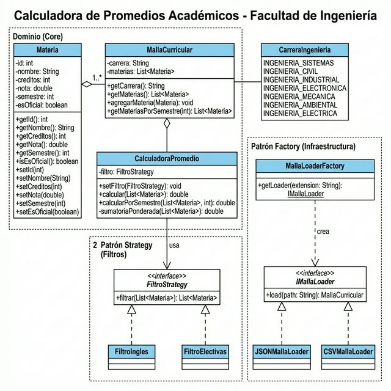

# Proyecto Diseño y Arquitectura de Software

 ## Presentación del Problema
 En el entorno universitario existe una alta desinformación y confusión entre los estudiantes respecto al calculo de sus notas, promedios semestrales y promedios ponderados a lo largo de su vida universitaria. Así pues, muchos de ellos no tienen claridad sobre:

 + Como calcular su promedio real
 + Que materias debemos incluir y que materias debemos excluir
 + El impacto de las asignaturas de acuerdo a su cantidad de creditos
 + Que se necesita para alcanzar ese promedio objetivo 

 Todo esto mencionado anteriormente lo consideramos realmente importante ya que un sistema claro y confiable para el calculo de nuestras notas nos puede ayudar a tomar mejores decisiones academicas, entender la situación real en la que nos encontramos en la universidad y reducir los errores y la desinformación. 

 ## Creatividad en la Presentación
 Para la presentación de nuestro proyecto, usaremos un video donde simularemos a un estudiante calculando su promedio, obteniendo resultados acertados mediante el uso de nuestra explicación. 

 Video: [Video Explicativo Problema](https://drive.google.com/file/d/1tVnDydv4E-2b3m-ql99MgLrWUwYksQWA/view?usp=sharing)

 ## Diseño de Software
 ### Principios SOLID aplicados:

 **S – Single Responsibility Principle (Responsabilidad Única):**
 Cada clase cumple una única función claramente definida por su nombre. La clase `Materia` se limita a representar los datos de una asignatura. `JSONMallaLoader` tiene como único propósito convertir un archivo JSON en objetos del dominio (`MallaCurricular`). `CalculadoraPromedio` se encarga exclusivamente de la lógica matemática del cálculo, y `main.py` solo orquesta la interacción con el usuario a través de la terminal.

 **O – Open/Closed Principle (Abierto/Cerrado):**
 Este principio se refleja en toda la carpeta `infrastructure`. Si en el futuro se requiere cargar mallas curriculares desde una base de datos SQL o desde una API externa, no es necesario modificar ninguna clase existente del núcleo del proyecto. Basta con crear una nueva clase (por ejemplo, `SqlMallaLoader`) que implemente la interfaz `IMallaLoader` y agregarla al sistema sin alterar el comportamiento ya existente.

 **D – Dependency Inversion Principle (Inversión de Dependencias):**
 La fábrica `MallaLoaderFactory.get_loader('json')` utilizada en `main.py` oculta el proceso de creación del loader. De esta forma, la clase principal trabaja con el loader a través de su contrato genérico (`IMallaLoader`), sin necesidad de depender directamente de una implementación concreta como `JSONMallaLoader`.

 ### Patrones de Diseño utilizados:

 **Factory Method (Creacional):**
 Este patrón se encuentra implementado en `infrastructure/malla_loader_factory.py`. Su función es crear objetos de la familia de `MallaLoaders` (como `JSONMallaLoader` o `CSVMallaLoader`), aislando la lógica de instanciación del cliente que los utiliza (en este caso, `main.py`). Esto facilita la extensión del sistema con nuevos formatos de carga sin afectar al código existente.

 **Strategy (De Comportamiento):**
 Este patrón se aplica en la carpeta `strategy/filtro_strategy.py`, mediante clases como `FiltroIngles` y `FiltroElectivas`. El patrón Strategy permite definir una familia de estrategias intercambiables en tiempo de ejecución. Gracias a esto, la calculadora puede aplicar distintos criterios, como ignorar los créditos de las asignaturas de Inglés, y permite agregar nuevos filtros en el futuro (por ejemplo, un `FiltroNivel1`) sin modificar la lógica existente.

 ### Diagrama UML
 

 ### Implementación 

 ### Analisis Tecnico
 El sistema presenta alta cohesión y bajo acoplamiento ya que cada clase tiene una responsabilidad definida, por ejemplo Materia  gestiona los datos de la asignatura, mientras que CalculadoraPromedio se encarga únicamente de los calculos necesarios. Ademas, los modulos se comunican mediante interfaces y el uso de FactoryMethod, evitando una dependencia directa.

 ### Creditos y Roles
 + Maria Jose Palomino Carreño 
 + Carlos Andres Diaz Mendez 
 + Manuel David Carreño Buitrago 
