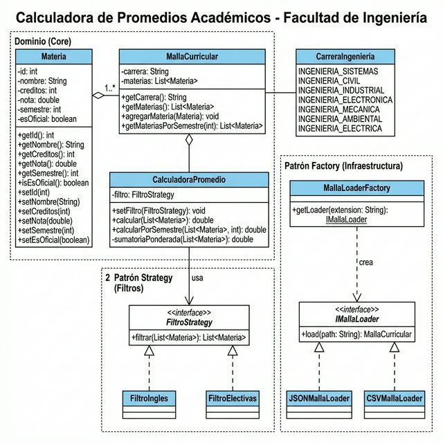

# Proyecto Diseño y Arquitectura de Software

 ## Presentacion del Problema
 En el entorno universitario existe una alta desinformacion y confusion entre los estudiantes respecto al calculo de sus notas, promedios semestrales y promedios ponderados a lo largo de su vida universitaria. Asi pues, muchos de ellos no tienen claridad sobre:

 + Como calcular su promedio real 
 + Que materias debemos incluir y que materias debemos excluir
 + El impacto de las asignaturas de acuerdo a su cantidad de creditos
 + Que se necesita para alcanzar ese promedio objetivo 

 Todo esto mencionado anteriormente lo consideramos realmente importante ya que un sistema claro y confiable para el calculo de nuestras notas nos puede ayudar a tomar mejores decisiones academicas, entender la situacion real en la que nos encontramos en la universidad y reducir los errores y la desinformacion. 

 ## Creatividad en la Presentacion
 Para la presentacion de nuestro proyecto, usaremos un video donde simularemos a un estudiante calculando su promedio, obteniendo resultados acertados mediante el uso de nuestra explicacion. 

 Video: [Video Explicativo Problema](https://drive.google.com/file/d/1tVnDydv4E-2b3m-ql99MgLrWUwYksQWA/view?usp=sharing)

---

## Primer Corte - Diseño de Software

 ### Principios SOLID aplicados:

 **S – Single Responsibility Principle (Responsabilidad Unica):**
 Cada clase cumple una unica funcion claramente definida por su nombre. La clase `Materia` se limita a representar los datos de una asignatura. `JSONMallaLoader` tiene como unico proposito convertir un archivo JSON en objetos del dominio (`MallaCurricular`). `CalculadoraPromedio` se encarga exclusivamente de la logica matematica del calculo, y `main.py` solo orquesta la interaccion con el usuario a traves de la terminal.

 **O – Open/Closed Principle (Abierto/Cerrado):**
 Este principio se refleja en toda la carpeta `infrastructure`. Si en el futuro se requiere cargar mallas curriculares desde una base de datos SQL o desde una API externa, no es necesario modificar ninguna clase existente del nucleo del proyecto. Basta con crear una nueva clase (por ejemplo, `SqlMallaLoader`) que implemente la interfaz `IMallaLoader` y agregarla al sistema sin alterar el comportamiento ya existente.

 **D – Dependency Inversion Principle (Inversion de Dependencias):**
 La fabrica `MallaLoaderFactory.get_loader('json')` utilizada en `main.py` oculta el proceso de creacion del loader. De esta forma, la clase principal trabaja con el loader a traves de su contrato generico (`IMallaLoader`), sin necesidad de depender directamente de una implementacion concreta como `JSONMallaLoader`.

 ### Patrones de Diseño utilizados:

 **Factory Method (Creacional):**
 Este patron se encuentra implementado en `infrastructure/malla_loader_factory.py`. Su funcion es crear objetos de la familia de `MallaLoaders` (como `JSONMallaLoader` o `CSVMallaLoader`), aislando la logica de instanciacion del cliente que los utiliza (en este caso, `main.py`). Esto facilita la extension del sistema con nuevos formatos de carga sin afectar al codigo existente.

 **Strategy (De Comportamiento):**
 Este patron se aplica en la carpeta `strategy/filtro_strategy.py`, mediante clases como `FiltroIngles` y `FiltroElectivas`. El patron Strategy permite definir una familia de estrategias intercambiables en tiempo de ejecucion. Gracias a esto, la calculadora puede aplicar distintos criterios, como ignorar los creditos de las asignaturas de Ingles, y permite agregar nuevos filtros en el futuro (por ejemplo, un `FiltroNivel1`) sin modificar la logica existente.

 ### Diagrama UML
 

 ### Implementacion 
El proyecto esta desarrollado en Python, estructurado en: domain, infraestructure y strategy. Las mallas curriculares se cargan desde el JSON. El calculo del promedio ponderado se realiza multiplicando la nota de cada materia por sus creditos y dividiendo entre el total de creditos y los filtros se aplican dinamicamente antes de realizar el calculo y la interaccion con el usuario se hace directamente desde el main.py

 ### Analisis Tecnico
 El sistema presenta alta cohesion y bajo acoplamiento ya que cada clase tiene una responsabilidad definida, por ejemplo Materia gestiona los datos de la asignatura, mientras que CalculadoraPromedio se encarga unicamente de los calculos necesarios. Ademas, los modulos se comunican mediante interfaces y el uso de FactoryMethod, evitando una dependencia directa.

---

## Segundo Corte - Evolucion Arquitectonica

En el segundo corte, el sistema evoluciono hacia una Arquitectura Orientada a Servicios (SOA), incorporando resiliencia, observabilidad y seguridad. La documentacion detallada de cada area se encuentra en la carpeta `docs/`.

### Arquitectura Orientada a Servicios (SOA)

El sistema ahora cuenta con dos servicios REST independientes que se comunican entre si:

- **Servicio Principal** (puerto 8000): expone `/login`, `/promedio` y `/promedio-objetivo`.
- **Servicio B** (puerto 8001): servicio proveedor que expone `/materias-extra`.

### Resiliencia

Se implementaron tres patrones de resiliencia en la comunicacion entre servicios: Timeout, Retry y Fallback. Aplicados en los endpoints `/promedio` y `/promedio-objetivo`.

### Observabilidad

Se integraron tres herramientas de monitoreo: Prometheus (metricas), Grafana (visualizacion) y Jaeger (tracing distribuido). Se levantan mediante Docker Compose.

### Seguridad

Se implemento autenticacion basada en JWT con control de acceso por roles. Los endpoints `/promedio` y `/promedio-objetivo` estan protegidos.

### Como ejecutar el proyecto

**Prerrequisitos:**
- Python 3.10+
- Docker (para el stack de observabilidad)

**1. Instalar dependencias:**
```bash
pip install -r requirements.txt
```

**2. Levantar los servicios de la aplicacion:**
```bash
uvicorn api.main:app --reload --port 8000
uvicorn service_b.main:app --reload --port 8001
```

**3. Levantar el stack de observabilidad:**
```bash
docker-compose up -d
```

**Accesos:**
- API principal: http://localhost:8000
- Servicio B: http://localhost:8001
- Prometheus: http://localhost:9090
- Grafana: http://localhost:3000 (admin/admin)
- Jaeger UI: http://localhost:16686
- Jaeger OTLP: http://localhost:4318

### Documentacion

La documentacion detallada se encuentra en:
- `docs/arquitectura.md` — Descripcion del sistema y arquitectura
- `docs/resiliencia.md` — Patrones de resiliencia implementados
- `docs/observabilidad.md` — Herramientas de monitoreo integradas
- `docs/seguridad.md` — Autenticacion JWT y control de acceso

---

 ### Creditos y Roles
 + Maria Jose Palomino Carreño 
 + Carlos Andres Diaz Mendez 
 + Manuel David Carreño Buitrago 
