# Entrega 3 

## 1. Pruebas Unitarias

Se implementaron pruebas unitarias con PyTest siguiendo el patrón AAA (Arrange - Act - Assert) y la metodología TDD.

### Metodología TDD aplicada

Se aplicó TDD como guía del desarrollo. Para cada funcionalidad se definieron primero los casos de prueba y se verificó que el código los satisficiera. Un ejemplo concreto fue el endpoint `/promedio` sin token: el test esperaba `403` pero el sistema retornaba `401`, lo que llevó a corregir el assert siguiendo el ciclo Red-Green-Refactor.

### Archivos de prueba

| Archivo | Clase probada | Tests |
|---|---|---|
| `tests/domain/test_materia.py` | `Materia` | Construcción, setters, validación de notas, cálculo de cortes, `__str__` |
| `tests/domain/test_calculadora.py` | `CalculadoraPromedio` | Promedio ponderado, lista vacía, créditos cero, por semestre, con filtros |
| `tests/strategy/test_filtro.py` | `FiltroIngles`, `FiltroElectivas` | Filtrado por nombre, insensible a mayúsculas, lista vacía |
| `tests/api/test_auth.py` | Login | Login exitoso admin, login exitoso student, contraseña incorrecta, usuario inexistente |
| `tests/api/test_endpoints.py` | Endpoints REST | `/promedio` con y sin token, nota inválida, `/promedio-objetivo` con roles |

### Mocks implementados

En `test_calculadora.py` se implementó un `MockFiltro` para probar que la calculadora acepta cualquier estrategia de filtrado:

```python
class MockFiltro:
    def filtrar(self, materias):
        return [m for m in materias if m.get_nota() >= 3.0]
```

### Resultados

- **29 tests pasando**
- **95% de cobertura de código** (superando el mínimo requerido del 80%)

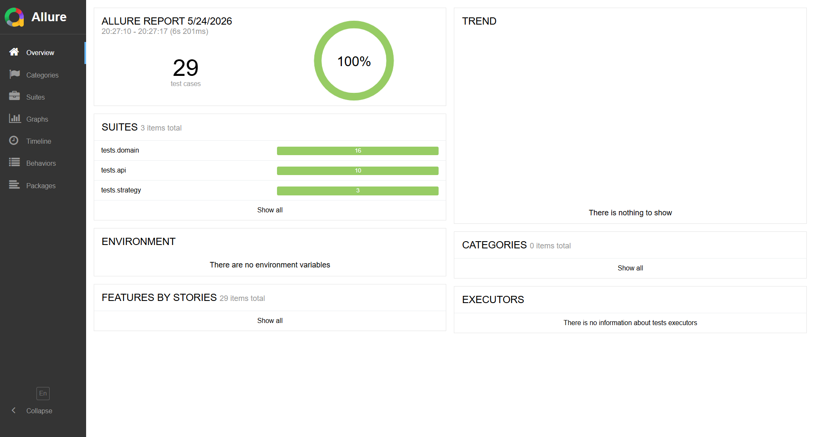
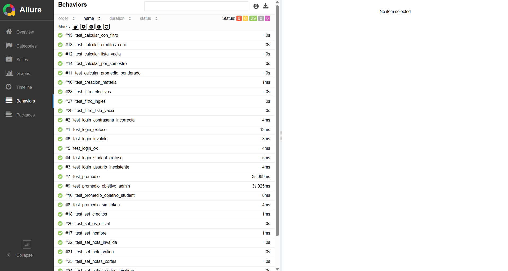

---

## 2. Pipeline CI/CD

### CI – Integración Continua (`ci.yml`)

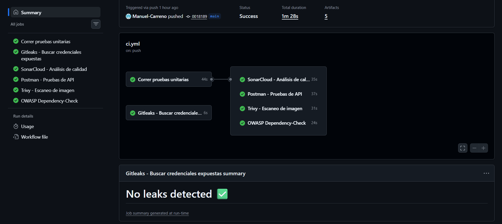

El pipeline de CI se ejecuta automáticamente en cada `push` o `pull request` a `main` y contiene 6 jobs:

| Job | Herramienta | Qué hace |
|---|---|---|
| `tests` | PyTest + Allure | Corre los 29 tests, mide cobertura y genera reporte visual |
| `gitleaks` | Gitleaks | Escanea el historial completo buscando credenciales expuestas |
| `sonarcloud` | SonarCloud | Análisis estático de calidad, seguridad y mantenibilidad |
| `postman` | Postman CLI | Corre la colección de pruebas de API |
| `trivy` | Trivy | Escanea la imagen Docker buscando vulnerabilidades |
| `dependency-check` | OWASP Dependency-Check | Verifica vulnerabilidades en las dependencias del `requirements.txt` |

### CD – Despliegue Continuo (`cd.yml`)

El pipeline de CD se activa automáticamente cuando el CI termina exitosamente y contiene 3 jobs:

| Job | Qué hace |
|---|---|
| `deploy` | Construye y publica las imágenes Docker en Docker Hub |
| `monitoring-check` | Levanta la API y Prometheus, verifica que `/metrics` responde y que Prometheus recibe métricas |
| `notify` | Genera un resumen del despliegue en GitHub Actions |

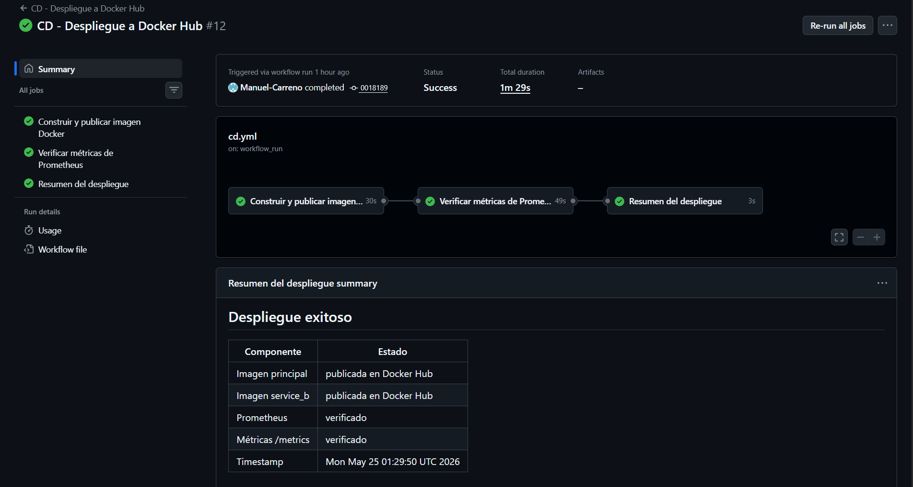
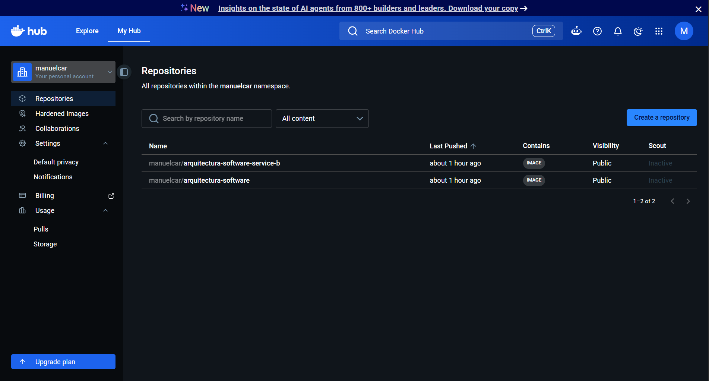

---

## 3. DevSecOps

### Gitleaks – Secrets Scanning

Gitleaks escanea todo el historial de commits buscando credenciales expuestas como API keys, tokens o contraseñas hardcodeadas. El escaneo del repositorio no detectó credenciales reales expuestas.

### SonarCloud – SAST

SonarCloud realiza análisis estático del código fuente detectando vulnerabilidades, bugs y problemas de mantenibilidad sin ejecutar el código.

Resultados del análisis:
- **Security**: 17 issues detectados (Rating E)
- **Reliability**: 0 issues detectados (Rating A)
- **Maintainability**: 10 issues (Rating A)
- **Security Hotspots**: 11 sin revisar

Para los resultados del analisis podemos notar **17 issues detected** pero esto se debe principalmente por credenciales hardcodeadas en el codigo y advertencias en los archivos del pipeline de `ci.yml` y `cd.yml` por el uso de `curl | sh` sin verificación de hash


### Trivy – Container Scanning

Trivy escanea la imagen Docker construida buscando vulnerabilidades conocidas (CVEs) en el sistema operativo base y las dependencias instaladas.

Trivy detectó 1 vulnerabilidad HIGH en `ncurses` (CVE-2025-69720, buffer overflow) 
y múltiples MEDIUM en paquetes del sistema base Debian (`glibc`, `util-linux`, 
`zlib`, `pip`). Ninguna vulnerabilidad pertenece al código Python de la aplicación. 
La versión de `pip 25.0.1` tiene fix disponible actualizando a `26.1`.


### OWASP Dependency-Check – Dependency Scanning

OWASP Dependency-Check analiza las dependencias del `requirements.txt` y las compara contra la base de datos de vulnerabilidades conocidas (NVD).

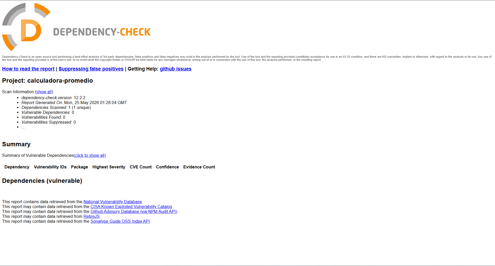

**DEPENDENCY-CHECK** no encotro vulnerabilidades

---

## 4. Pruebas de Carga

Se implementaron pruebas de carga con k6 simulando múltiples usuarios simultáneos accediendo a los tres endpoints de la API.

### Escenario probado

Cada usuario virtual ejecuta en loop:
1. Login → obtiene token JWT
2. POST `/promedio` → calcula promedio ponderado
3. POST `/promedio-objetivo` → calcula nota requerida

### Resultados comparativos

| VUs | p(95) | Fallos | Umbral | Resultado |
|---|---|---|---|---|
| 10 | 9.05s | 0% | < 2s | ✅ sin fallos |
| 50 | 10.21s | 0% | < 10s | ⚠️ límite del umbral |
| 100 | 18.49s | 0% | < 10s | ❌ supera umbral |

### Hallazgo identificado

El cuello de botella es el mecanismo de resiliencia del `service_b` — el timeout de 2 segundos con 3 reintentos genera una latencia mínima de 6 segundos por request cuando `service_b` no está disponible. El sistema es **estable** (0% de fallos en todos los escenarios) pero la latencia aumenta con la carga.

**Solución propuesta**: reducir el timeout a 1 segundo o los reintentos a 2 cuando `service_b` no está disponible en el entorno de producción.

---

## 5. Pruebas de API

Se creó una colección en Postman con 3 requests que cubren los endpoints principales de la API.

| Request | Método | Endpoint | Tests |
|---|---|---|---|
| Login (admin) | POST | `/login` | Status 200, token recibido |
| Calcular Promedio | POST | `/promedio` | Status 200, promedio_calculado en respuesta |
| Promedio Objetivo | POST | `/promedio-objetivo` | Status 200, nota_requerida en respuesta, es_alcanzable en respuesta |

**Resultado: 7/7 tests pasando**

La colección se corre automáticamente en el pipeline CI mediante Postman CLI en cada push.

---

## 6. Observabilidad y Monitoreo

### Prometheus

Prometheus recolecta métricas del servicio principal cada 15 segundos desde `/metrics`. En el pipeline CD se verifica automáticamente que Prometheus está healthy y recibiendo métricas después de cada despliegue.

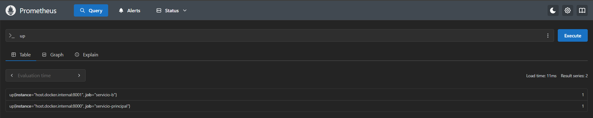
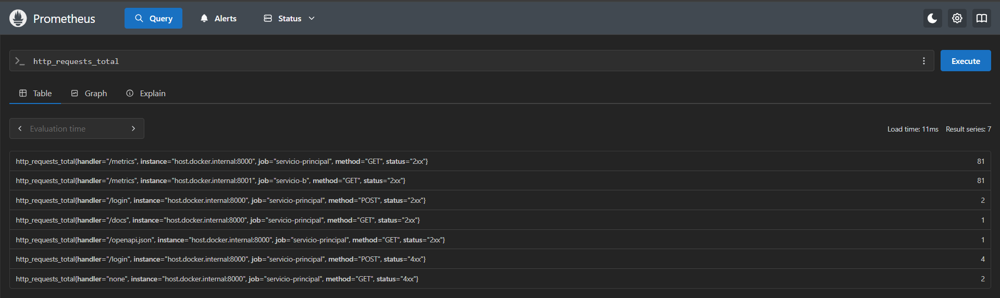

### Grafana

Grafana visualiza las métricas recolectadas por Prometheus en un dashboard con paneles de requests totales, latencia promedio y códigos de respuesta.

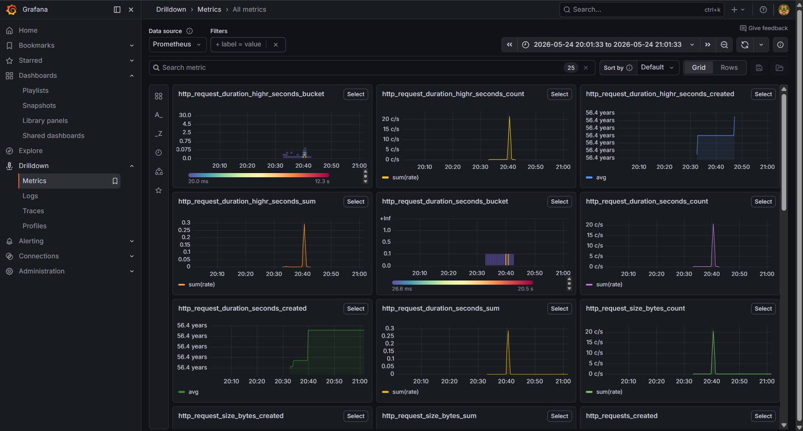

### Jaeger – Tracing Distribuido

Jaeger registra el recorrido completo de cada solicitud a través de los servicios, permitiendo identificar cuánto tarda cada componente.

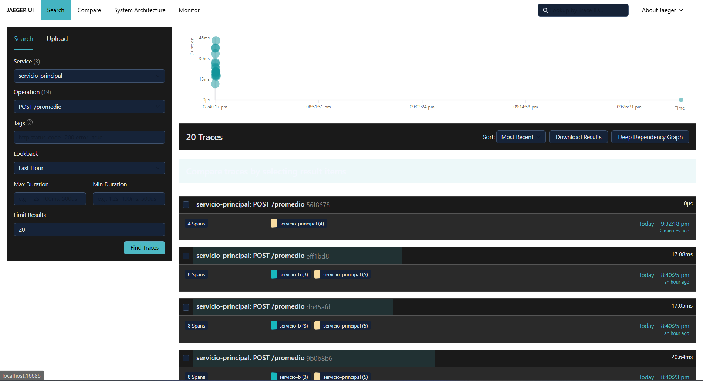
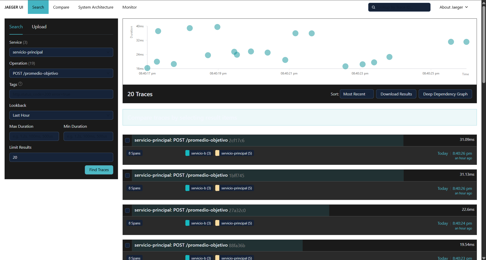

---

## 7. Retos Técnicos y Soluciones

| Reto | Solución |
|---|---|
| `--cov-omit` no funciona en GitHub Actions | Se creó `.coveragerc` con la configuración de exclusiones |
| `ModuleNotFoundError` en GitHub Actions | Se agregó `PYTHONPATH: ${{ github.workspace }}` al job de tests |
| SonarCloud fallaba por organización incorrecta | Se corrigió el key de organización en `sonar-project.properties` |
| SonarCloud conflicto con Automatic Analysis | Se desactivó el análisis automático en la configuración del proyecto |
| Timeout del `service_b` afecta las pruebas de carga | Se documentó como hallazgo y se propuso reducir timeout/reintentos |
| Status code 401 vs 403 en pruebas sin token | FastAPI retorna 401 para no autenticado y 403 para sin permisos — se corrigieron los asserts |
