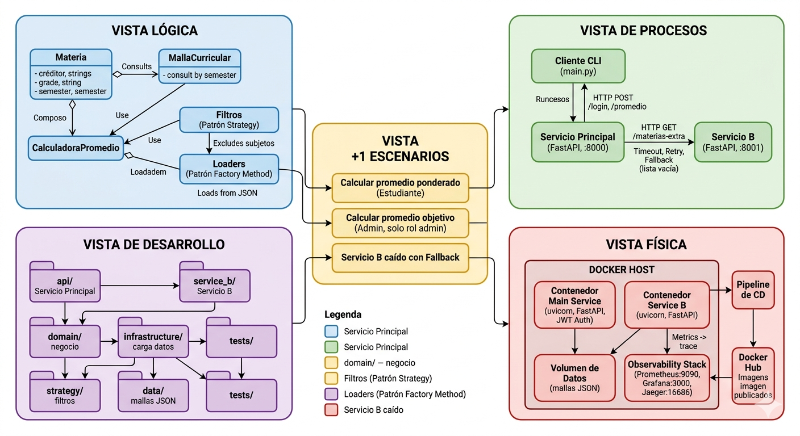
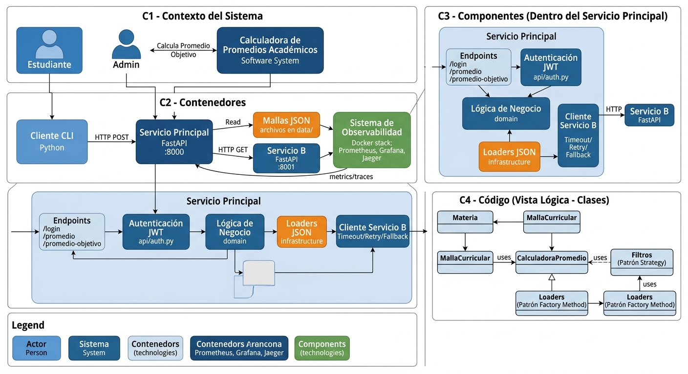

# Modelos Arquitectonicos: 4+1 y C4

El sistema es una **calculadora de promedios academicos** para la Facultad de Ingenieria:
permite a un estudiante calcular su promedio ponderado, aplicar filtros sobre las materias
y saber que nota necesita para alcanzar un promedio objetivo. Lo documentamos con dos
modelos complementarios. El **modelo 4+1** muestra el sistema desde varias vistas (que hace,
como corre, como se organiza el codigo y donde se despliega). El **modelo C4** lo describe
en cuatro niveles de detalle, del mas general al codigo.

---

## Modelo 4+1

### Vista Logica — que hace el sistema

Son las piezas del negocio y sus responsabilidades: aqui viven las reglas de calculo.

| Clase / Modulo | Responsabilidad |
|---|---|
| `Materia` | Representa una asignatura (creditos, semestre, nota). |
| `MallaCurricular` | Agrupa las materias y las consulta por semestre. |
| `CalculadoraPromedio` | Calcula el promedio ponderado (nota × creditos / total de creditos). |
| Filtros (patron Strategy) | Excluyen ciertas materias antes de calcular (p. ej. ingles). |
| Loaders (patron Factory) | Cargan las mallas desde archivos JSON. |

### Vista de Procesos — que corre en ejecucion

El sistema usa una arquitectura orientada a servicios (SOA): dos servicios REST y un cliente.

| Proceso | Puerto | Rol |
|---|---|---|
| Cliente CLI (`main.py`) | — | Interactua con el usuario por consola. |
| Servicio Principal (`api/`) | 8000 | Autentica, calcula promedios y orquesta. |
| Servicio B (`service_b/`) | 8001 | Provee sugerencias de materias extra. |

El Servicio Principal llama al Servicio B con patrones de resiliencia (Timeout, Retry y
Fallback): si el Servicio B falla, el calculo continua sin interrumpir al usuario.

### Vista de Desarrollo — como se organiza el codigo

Separacion por capas: `domain/` (negocio), `infrastructure/` (carga de datos),
`strategy/` (filtros), `api/` (Servicio Principal), `service_b/` (Servicio B),
`data/` (mallas JSON) y `tests/` (pruebas).

### Vista Fisica — donde se despliega

| Puerto | Componente |
|---|---|
| 8000 / 8001 | Servicios (uvicorn o contenedor Docker) |
| 9090 / 3000 / 16686 | Prometheus / Grafana / Jaeger (Docker) |
| Docker Hub | Imagenes publicadas por el pipeline de CD |

### Vista +1: Escenarios — casos de uso que amarran todo

- **Calcular promedio:** el usuario hace login, recibe un token JWT, envia sus materias a `/promedio` y obtiene el resultado mas las materias extra.
- **Promedio objetivo (solo rol admin):** en `/promedio-objetivo` el sistema calcula la nota necesaria en las materias pendientes; si el rol no es admin, responde 403.
- **Servicio B caido:** tras el timeout y los reintentos, el sistema usa un fallback (lista vacia) y el usuario igual recibe su promedio.

---

## Modelo C4

El modelo C4 describe el sistema en cuatro niveles, del mas general al mas detallado:
Contexto, Contenedores, Componentes y Codigo. Cada nivel agrega detalle sobre el anterior
y esta dirigido a una audiencia distinta.

### C1 — Contexto: el sistema y quien lo usa

El nivel mas general. Presenta el sistema completo y los actores que interactuan con el,
sin detalles tecnicos.

| Actor / Sistema | Interaccion |
|---|---|
| Estudiante / Admin | Consulta su promedio, oportunidades y la nota necesaria para una meta. |
| Calculadora de Promedios | Recibe los datos academicos, calcula y devuelve los resultados. |

### C2 — Contenedores: las aplicaciones que lo componen

Muestra las aplicaciones desplegables del sistema y como se comunican entre si. El sistema
no es un solo programa, sino varias piezas independientes.

| Contenedor | Tecnologia | Responsabilidad |
|---|---|---|
| Cliente CLI | Python | Interfaz por consola con el usuario. |
| Servicio Principal | FastAPI | Autenticacion, calculo y orquestacion. |
| Servicio B | FastAPI | Provee materias extra sugeridas. |
| Mallas curriculares | Archivos JSON | Guardan las materias por carrera. |
| Observabilidad | Prometheus / Grafana / Jaeger | Metricas, visualizacion y trazas. |

Todos se comunican por HTTP; el Servicio Principal es el consumidor y el Servicio B el proveedor.

### C3 — Componentes: dentro del Servicio Principal

Detalla las piezas internas del contenedor principal (el Servicio Principal).

| Componente | Funcion |
|---|---|
| Endpoints (`/login`, `/promedio`, `/promedio-objetivo`) | Reciben las peticiones y devuelven respuestas. |
| Autenticacion (`api/auth.py`) | Valida credenciales, emite y verifica el JWT y controla los roles. |
| Logica de negocio (dominio) | Reutiliza `CalculadoraPromedio` y `Materia` para calcular. |
| Cliente del Servicio B | Llama al Servicio B aplicando Timeout, Retry y Fallback. |

### C4 — Codigo: el detalle de las clases

El ultimo nivel detalla las clases concretas y sus relaciones. Coincide con la Vista Logica
del modelo 4+1 (ver tabla de clases arriba). El diagrama de clases UML del proyecto esta en
`assets/diagrama_clases_uml.png`.

---

## Equivalencias entre 4+1 y C4

Ambos modelos describen el mismo sistema. Esta tabla muestra como se corresponden.

| Modelo 4+1 | Equivale a (C4) |
|---|---|
| Vista Logica | C3 / C4 (componentes y codigo) |
| Vista Fisica | C2 (contenedores desplegables) |
| Vista de Procesos | C2 visto en ejecucion |
| Vista +1 Escenarios | Relaciones de C1 (actores y sistema) |
